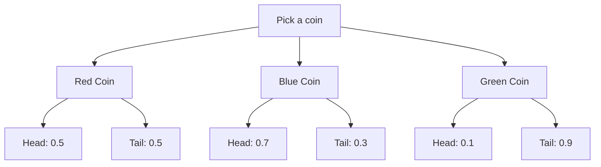
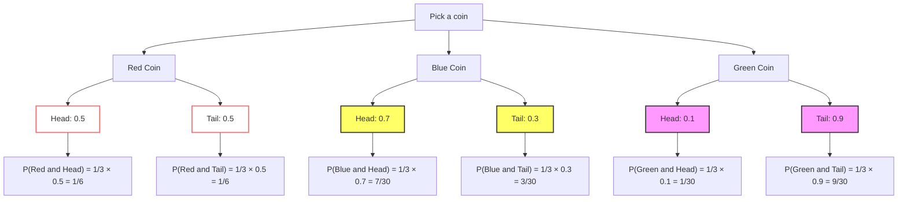

# Tree Diagrams Of Sequential Events

Lecture Date:: 2024-10-09

Instructors:: Marco Lehmann

Course:: AI Foundations

Week:: 4

## Learning Objectives:

Many real-world situations can be modeled as sequences of random events (multi-step experiments). Examples include:

- Selecting a random card from one of two decks after randomly choosing a deck.
- Deciding where to eat using a coin flip, followed by rolling a dice to choose a menu item.

These scenarios, known as **multi-step experiments**, are common and involve applying basic rules of probability. The goal is to:

- Learn how to visualize these experiments using **Tree Diagrams**.
- Understand the probability rules behind such sequences of events, especially in **two-step experiments** (German: _zweistufiges Zufallsexperiment_).
- Develop a method to **model the generative process** of random outcomes, linking domain knowledge with data. This leads to the broader concept of **Generative Models** in probability and AI.

## Visualization with Tree Diagrams

Tree diagrams help us:

- Visualize how data is generated in a probabilistic setting.
- Understand relationships between random variables.

## Example Problem

You are given three coins with different probabilities of showing heads:

- Red Coin: $P(Head) = 0.5$
- Blue Coin: $P(Head) = 0.7$
- Green Coin: $P(Head) = 0.1$

You randomly select one coin and toss it. What is the probability of getting heads?  
Using the tree diagram approach, we can visualize and calculate each path's outcome probability.

## Formula:

We multiply the probabilities along each branch:
$$Pr(X, Y) = Pr(X) * Pr(Y | X)$$

The final probabilities for observing heads will be summed across all paths that lead to heads.

